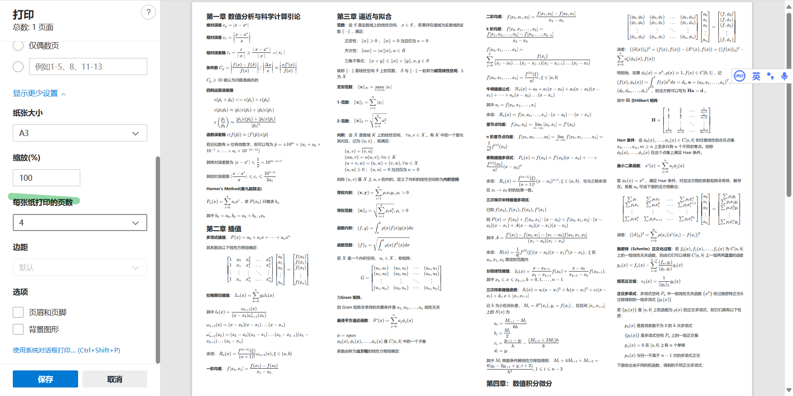
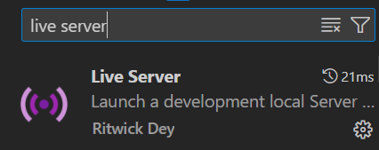

# 介绍

用于数值计算课程的公式纸，由于本人不会latex，于是用html+css实现分栏，读取markdown合并，再用浏览器的打印功能导出A3即可

在线预览网页：https://nmfp.skyw.cc/test.html

误入：关注MSC喵，谢谢喵

https://www.sysumsc.cn/

## 后期如何调整打印到双面A3?

目前想法是先完成所有笔记，再调整每栏放什么，具体可参考`bootstarp栅格系统`

使用edge浏览器打印功能，可以选择每页打印多少，是可以压到两页的，具体美观方面可能要先网页调整栏数



如果后期没办法通过调整css实现（个人感觉是可以），再考虑用PPT粘贴图片或者doc等办法

# 辅助工具

图片转latex

https://simpletex.cn/

# pdf资源下载

用于识别出latex公式

https://wp.007irs.com/s/7kLhn

# 本地开发指南

`fork`本项目，`git clone`到本地

`VSCODE`安装`Live Server`插件



在`text.html`右键选择 Open with live server 即可预览


不同数字的文件夹用于不同单元的内容，使用`markdown`+`latex`语法

建议使用`###`作为标题头

```

使用 latex 需要使用 $行内公式$ 或者 $$单行公式$$，可以借助 simpletex 识别图片导出为`markdown`的`$`格式

请注意，使用行内公式时，需要在$..$前后有空格 比如 设 $S$ 是实数域上的线性空间

可以使用notepad++的正则表达式替换`\$\s*([^$]*?)\s*\$`替换为` \$\1\$ `

使用$$单行公式$$，需要保证$$前后不含空格


```
开发后可以在网页预览或者在本地markdown编辑器预览

完成后提交 pr 即可合并 https://github.com/xy3xy3/NumericalMethodsFormulaPaper/pulls 